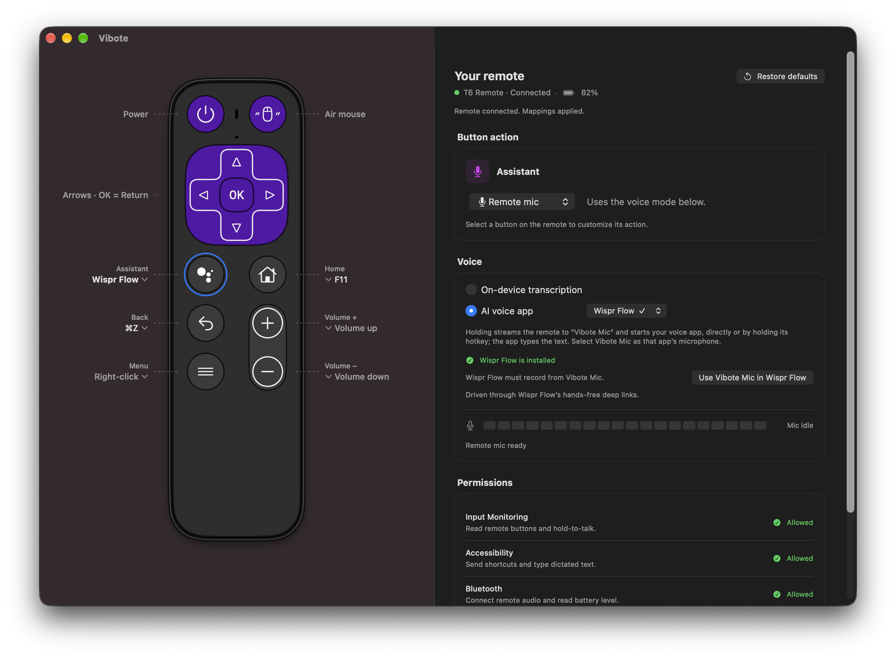

# Vibote

Vibe coding from your remote. Vibote is a macOS app that turns a Bluetooth TV remote into a coding controller: map its buttons to keys, shortcuts or apps, and hold a button to talk through the remote's own microphone, transcribed on your Mac or by your favorite AI voice app.



## Features

- **Visual remote map.** Every button is drawn on screen with its current action. Click a label to change it in place; buttons light up as you press them.
- **Button actions.** Default, any keyboard key (held while the button is held), a shortcut such as ⌘Z, open an app, or Remote mic.
- **Hold-to-talk with the remote's mic.** The remote streams audio over Bluetooth; Vibote decodes it and either transcribes it on-device or hands it to an AI voice app.
- **AI voice app integrations.** Handy, Wispr Flow and Superwhisper are started and stopped directly; any other dictation app works by holding its hotkey.
- **Vibote Mic.** A bundled virtual microphone, so any app can record from the remote. No BlackHole needed.
- **Status at a glance.** Connection, remote battery, a live input-level meter, and a permissions checklist.
- **Start at login.** Enable it in the General panel to open Vibote each time you sign in. The setting follows macOS Login Items and refreshes when you return to the app.

Supported remote: T6 Remote (vendor `0x620A`, product `0x0407`). New models are added as a `RemoteModel` in `Sources/App.swift`.

The T6 also has a full Bluetooth QWERTY keyboard on the back, for typing while using the front buttons for shortcuts and voice. **Support for more remotes is coming soon.** To request your model, [open a remote support request](https://github.com/pankan/vibote/issues/new). Include the brand and model, a product link or front/back photos, and whether you can help test it on your Mac.

These are the cheapest listings we found as of 30 September 2026: [Amazon India — ETZIN EPL-1536WA](https://www.amazon.in/dp/B0G2HF5FZN) and [Flipkart India — Tobo TD-1536WA](https://www.flipkart.com/tobo-wireless-remote-keyboard-mouse-2-4g-bluetooth-connectivity-1200-android-windows-mac-os-smart-tv-android-td-1536wa-controller/p/itm118b8044425cb?pid=REMHGVNB5ZXBN4YV). These are not referral links. Price range: ₹650–₹900; prices and delivery charges can change.

## Getting started

Requires macOS 14 or later. Supports Apple silicon and Intel Macs.

1. [Download Vibote.dmg](https://github.com/pankan/vibote/releases/latest/download/Vibote.dmg) and open it.
2. Drag **Vibote.app** into **Applications**, eject the disk image, and open Vibote from Applications.
3. Pair the remote in **System Settings → Bluetooth** and follow Vibote's **Permissions** panel.
4. Hold **Assistant** and speak. By default the text is transcribed on-device and typed into the focused app.

This open-source build is not notarized. If macOS blocks it, go to **System Settings → Privacy & Security → Open Anyway** for Vibote and confirm opening it.

For AI voice apps, select **Voice → AI voice app**, click **Install Vibote Mic**, and choose **Vibote Mic** as the voice app's microphone. Installation asks for administrator approval and briefly restarts audio.

Keep Vibote running: macOS clears key remaps whenever the remote reconnects, and Vibote reapplies them.

Enable **General → Start at login** to open Vibote automatically. If macOS needs approval, use the **Settings…** button to allow Vibote in Login Items. Keep the app in a stable location (for example, `/Applications`) before enabling this setting.

### Build from source

For development, install the Xcode command-line tools, then:

```sh
./scripts/build.sh               # builds the universal build/Vibote.app
open build/Vibote.app
```

To build a versioned release DMG:

```sh
./scripts/create-dmg.sh          # build/Vibote-VERSION.dmg and checksum
```

The DMG opens with a branded background, large icons, and a drag-to-Applications guide. It includes the app and its bundled microphone driver; license and installation text are in the hidden `.Installation` folder. Local checksums are written beside the versioned DMG in `build/`; published releases include `SHA256SUMS.txt`. Packaging uses Python 3 and installs the pinned `dmgbuild` tool into `.build/dmg-tools` on the first run.

## Landing page

The static landing page lives in `docs/`. Preview it locally:

```sh
python3 -m http.server 8080 --directory docs
```

Then open `http://localhost:8080`. It has no build step; the page loads DM Sans from Google Fonts. The GitHub Pages workflow deploys `docs/` from `main` after Pages is configured to use **GitHub Actions**. The public URL is [pankan.github.io/vibote](https://pankan.github.io/vibote/).

## Default mapping

| Button | Action |
|---|---|
| Assistant | Remote mic (hold to talk) |
| Home | F11 (Show Desktop) |
| Back | ⌘Z (Undo) |
| Menu | Right-click (remote's own behavior) |
| Volume + / − | Mac volume (remote's own behavior) |
| OK, arrows | Return and arrow keys (remote's own behavior) |
| Power, Air mouse | Not remappable: handled inside the remote |

**Restore defaults** brings this layout back. The Assistant button's Spotlight tap is always suppressed.

## Button actions

Click the label beside any button on the map, or use the **Button action** card:

- **Default:** the remote's own behavior.
- **Keyboard key:** remapped with `hidutil` for this remote only; the key stays held while the button is held, so it works for hold-to-talk hotkeys.
- **Shortcut:** common shortcuts (Undo, Redo, Copy, Paste, Save, New tab, Command palette, …) or any custom combination.
- **Open app:** launches or switches to an app.
- **Remote mic:** hold to talk, using the voice mode below.

## Voice

The remote uses Google's Android TV Voice-over-BLE protocol (16 kHz ADPCM). Start speaking about half a second after pressing, while the remote opens its mic.

### On-device transcription (default)

Hold, speak, release: Apple's on-device speech recognition types the text into the focused app. Nothing leaves your Mac and no other app is needed.

### AI voice app

Holding streams the remote into **Vibote Mic** and starts your dictation app, which types the text. Click **Install Vibote Mic** in the Voice panel, then select Vibote Mic as that app's microphone. Apps are defined in `Sources/VoiceApps.swift`; installed ones are marked ✓.

| App | Control | How |
|---|---|---|
| [Handy](https://handy.computer) | Direct | `SIGUSR2` to the running app. Vibote can install Handy with Homebrew, keeps it running in the background and checks its microphone setting. |
| [Wispr Flow](https://wisprflow.ai) | Direct | `wispr-flow://start-hands-free` and `stop-hands-free`; **Use Vibote Mic in Wispr Flow** switches its microphone in one click. |
| [Superwhisper](https://superwhisper.com) | Direct (beta) | `superwhisper://record` to start; `superwhisper://mode` to stop. |
| VoiceInk, Spokenly, MacWhisper, Aqua Voice, OpenWhispr, Monologue, Willow Voice, any other app | Hotkey | Vibote holds the app's push-to-talk key while the button is held. |

Direct-control deep links open in the background, so the app you're typing into keeps focus.

### Vibote Mic

A virtual microphone implemented as a Core Audio HAL plug-in (`Driver/ViboteMic.c`): a mono 48 kHz loopback device. Vibote plays remote audio into it and apps record it as a normal input. It is never offered as a system output.

The app bundles the driver. In **Voice → AI voice app**, click **Install Vibote Mic**. macOS asks for administrator approval, then audio restarts briefly. No separate terminal setup is needed.

For manual installation or removal during development:

```sh
./scripts/install-mic.sh              # build and install
./scripts/install-mic.sh --uninstall  # remove
```

## Permissions

| Permission | Used for |
|---|---|
| Input Monitoring | Reading button presses (Shortcut, Open app, Remote mic) |
| Accessibility | Sending shortcuts and typing dictated text |
| Bluetooth | Connecting to the remote's microphone and reading its battery |
| Speech Recognition | On-device transcription (only in that mode) |

Plain keyboard-key remaps need none of these. The build is ad-hoc signed, so macOS may ask again after a rebuild or after moving the app; the Permissions card shows what's missing.

## Project layout

| Path | Contents |
|---|---|
| `Sources/App.swift` | Remote model, button mapping, remote map UI and settings |
| `Sources/BluetoothProbe.swift` | Bluetooth voice protocol, hold-to-talk, battery |
| `Sources/ADPCM.swift` | Remote audio decoder |
| `Sources/AudioBridge.swift` | Plays remote audio into Vibote Mic |
| `Sources/VoiceApps.swift`, `Sources/Handy.swift` | AI voice app registry and Handy integration |
| `Driver/` | Vibote Mic HAL plug-in |
| `scripts/` | Build, mic install and icon scripts (`make-icon.sh` regenerates `Resources/AppIcon.icns`) |

## Verification

```sh
./scripts/check.sh
./scripts/build.sh
```

## Contributing and releases

See [CONTRIBUTING.md](CONTRIBUTING.md) for development, [CHANGELOG.md](CHANGELOG.md) for versions, and [the release guide](maintenance/RELEASING.md) for publishing. Report vulnerabilities privately using [SECURITY.md](SECURITY.md). Read [PRIVACY.md](PRIVACY.md) for local storage and voice handling.

The first release is early software. Automated checks do not replace testing Bluetooth, permissions, and audio with a physical remote.

## License

Vibote is released under the [MIT License](LICENSE). Third-party apps it integrates with, such as Handy (also MIT), Wispr Flow and Superwhisper, are separate products under their own licenses; Vibote does not bundle them.
